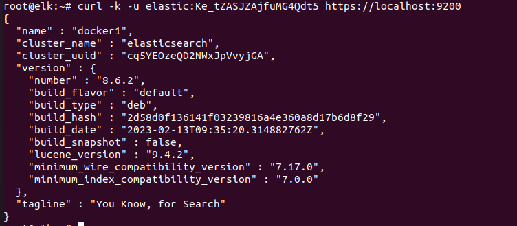
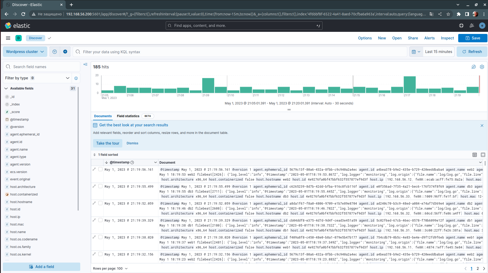

### Установка ELK на ubuntu 20.04.
1. Добавим ВМ в наш проект и назовем ее elk.
2. В России репозитории ELK заблокированы, для обхода воспользуемся зеркалом Я.
```echo "deb [trusted=yes] https://mirror.yandex.ru/mirrors/elastic/8/ stable main" | sudo tee /etc/apt/sources.list.d/elastic-8.x.list```
3. Обновим репозитории
```apt update```
4. Устанавливаем elasticsearch
```apt install elasticsearch```
5. Запомним пароль из строчки The generated password for the elastic built-in superuser is : Ke_tZASJZAjfuMG4Qdt5
6. Настроим сервис
```systemctl daemon-reload```
```systemctl enable elasticsearch.service```
```systemctl start elasticsearch.service```
7. Проверим статус кластера
```curl -k -u elastic:Ke_tZASJZAjfuMG4Qdt5 https://localhost:9200```

8. Установим веб-интерфейс Kibana
```apt install kibana```
9. Настроим сервис
```systemctl enable kibana```
```systemctl start kibana```
10. Перейдем на сайт http://192.168.56.200:5601/ и настроим Kibana. Для этого необходимо получить и скопировать токен, затем получить код верефикации.
```/usr/share/elasticsearch/bin/elasticsearch-create-enrollment-token -s kibana```
```/usr/share/kibana/bin/kibana-verification-code```
11. Следующим шагом будет установка сборщика логов logstash.
```apt install logstash```
12. Настроим сервис.
```systemctl enable logstash```
```systemctl start logstash```
13. Отредактируем следующие файлы:
```nano /etc/logstash/conf.d/input.conf```
```nano /etc/logstash/conf.d/filter.conf```
```nano /etc/logstash/conf.d/output.conf```
14. Применим конфигурацию
```/usr/share/logstash/bin/logstash --path.settings /etc/logstash -t```
15. Перезапускаем logstash
```systemctl restart logstash```
16. Проверим порт
```ss -tunlp | grep 5044```

### Установка клиентов
1. Добавим репозиторий Я.
```echo "deb [trusted=yes] https://mirror.yandex.ru/mirrors/elastic/8/ stable main" | sudo tee /etc/apt/sources.list.d/elastic-8.x.list```
```apt update```
2. Установим filebeat
```apt install filebeat```
3. Скопируем конфигурацию 
```nano /etc/filebeat/filebeat.yml```
4. Настроим сервис
```systemctl enable filebeat```
```systemctl start filebeat```

### Проверим что в логи приходят:

